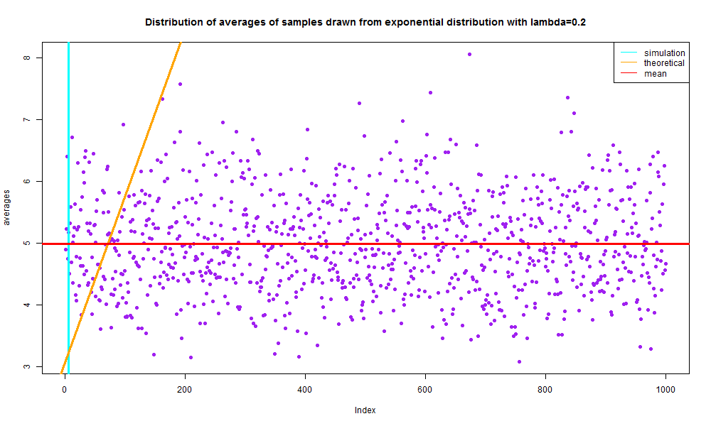
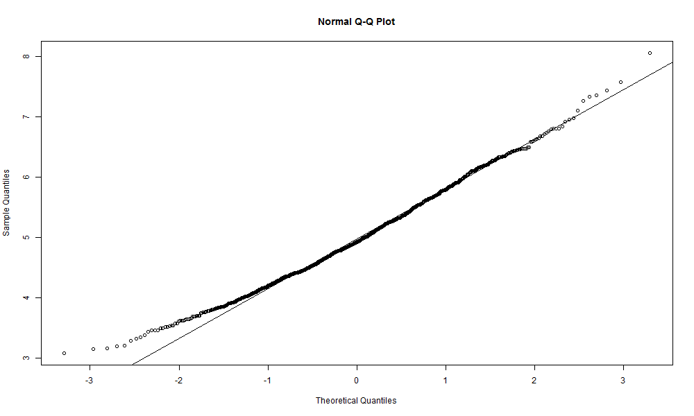
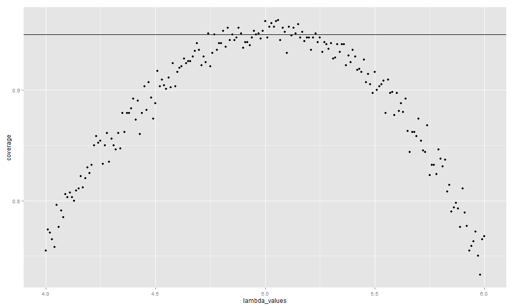

# Statistical Inference Course Project

### Part 1: Simulation Exercises

The exponential distribution can be simulated in `R` with `rexp(n, lambda)` where
`lambda` is the rate parameter. The mean of exponential distribution is 
`1/lambda` and the standard deviation is also `1/lambda`. For this simulation,
we set `lambda=0.2`. 

Through this simulation we will be able to investigate the distribution of the averages of 40 numbers sampled from an exponential distribution with a a `lambda` value equial to 0.2.

First, we need to do a thousand simulated averages of 40 exponentials, so that we may have enough sampled data to work.

```r
# Set a seed so that you may reproduce the exact same random sample numbers 
set.seed(1)
# Set values for lambda, the number of simulations we'll do, and the sample size
lambda <- 0.2
simulations <- 1000
sample <- 40
# Run the simulation and order the data in a matrix, then get a vector of averages.
data <- matrix(rexp(simulations*sample, rate=lambda), simulations, sample)
averages <- rowMeans(data)
```

Now we can plot a histogram of our vector of averages so we can observe the distribution of our data.

```r
# Plot the histogram of averages
png("averages.png", width=1000, height=600)
barplot(averages, main = "Distribution of averages of samples drawn from exponential distribution with lambda=0.2", col="purple")
# Plot a density line
lines(density(averages))
# Plot the center of the distribution
abline(v=1/lambda, col="cyan", lty=1, lwd=3)
# Plot the theoretical density of the averages of samples
xfit <- seq(min(averages), max(averages), length=100)
yfit <- dnorm(xfit, mean=1/lambda, sd=(1/lambda/sqrt(sample)))
abline(xfit, yfit, pch=22, col="orange", lty=1, lwd=3)
#Plot the mean
meanavgs <- mean(averages)
abline(h=meanavgs, col="red", lty=1, lwd=3)
# Add a legend
legend('topright', c("simulation", "theoretical", "mean"), lty=c(1,1,1), col=c("cyan", "orange", "red"))
dev.off()
```



The distribution of sample means is centered at 4.990025 and the theoretical center of the distribution is `lambda^{-1} = 5`.

The variance of sample means is 0.6258 where the theoretical variance of the distribution is `sigma^2 / n = 1/(lambda^2 n) = 1/(0.04 times 40) = 0.625`.

According to the central limit theorem, the averages of samples follow normal distribution. Also, this q-q plot below suggests the normality.

```r
png("normaldist.png", width=1000, height=600)
qqnorm(averages); qqline(averages)
dev.off()
```




We also need to evaluate the coverage of the confidence interval for `1/lambda = bar{X} pm 1.96 frac{S}{sqrt{n}}`

```r
lambda_values <- seq(4, 6, by=0.01)
coverage <- sapply(lambda_values, function(lamb) {
    mus <- rowMeans(matrix(rexp(sample*simulations, rate=0.2),
                               simulations, sample))
    lowerlimit <- mus - qnorm(0.975) * sqrt(1/lambda**2/sample)
    upperlimit <- mus + qnorm(0.975) * sqrt(1/lambda**2/sample)
    mean(lowerlimit < lamb & upperlimit > lamb)
})

library(ggplot2)
qplot(lambda_values, coverage) + geom_hline(yintercept=0.95)
```



The 95% confidence intervals for the rate parameter (`lambda`) to be estimated
(`hat{lambda}`) are `hat{lambda}_{low} = hat{lambda}(1 - frac{1.96}{sqrt{n}})`    
&  
`hat{lambda}_{upp} = hat{lambda}(1 + frac{1.96}{sqrt{n}})`.

In the plot above, we can clearly observe that for selection of `hat{lambda}` around 5,
the average of the sample mean falls within the confidence interval at least 95% of the time.   
Note that the true rate, `lambda` is 5.