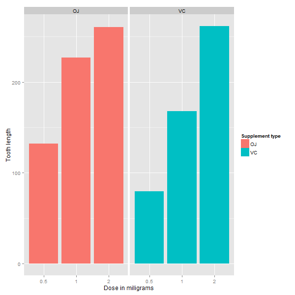

For this second part of the project, we will analyze the `ToothGrowth` data in the R datasets package. The data comprises a set of 60 observations of the length of odontoblasts (teeth) in 10 guinea pigs at three different dose levels of Vitamin C
(0.5, 1 and 2 mg) using two different delivery methods (orange juice or ascorbic acid).

### Data Analysis
```{r}
library(datasets)
library(ggplot2)
ggplot(data=ToothGrowth, aes(x=as.factor(dose), y=len, fill=supp)) +
    geom_bar(stat="identity",) +
    facet_grid(. ~ supp) +
    xlab("Dose in miligrams") +
    ylab("Tooth length") +
    guides(fill=guide_legend(title="Supplement type"))
```


From the previous plot, we can clearly observe a positive correlation between the length of the tooth and the doseage of Vitamin C for both of the delivery methods.

This observed effect of the Vitamin C dose on the tooth length can be ovserved also by using regresssion analysis. We must try to test if the supplement type (delivery method) has an effect on the tooth length, so we must analyze the tooth lengths  of two separate samples: One where the delivery method has been orange juice and another where the delivery method has been ascorbic acid. If we find a significant difference in the variance of the tooth lengths between the two methods, it will mean that one method is more or less effective in the delivery of Vitamin C than the other.


```{r}
diff <- lm(len ~ dose + supp, data=ToothGrowth)
summary(diff)
```

As we may observe in this model, 70% of the variance in the data is explained.
We can locate the intercept at `diff$coefficients[[1]]`, which means that those subjects who didn't take a supplement will have an average tooth length of meaning that `diff$coefficients[[1]]` units (we presume it's milimiters). 

We can also observe that the coefficient of `dose` is `diff$coefficients[[2]]`. We may infer that as we increase the dose of Vitamin C in 1mg without changing the supplement type, the tooth length measure would increase by `diff$coefficients[[2]]` units.

Additionally we can observe that there's a coefficient for each supplement type. 'Supplement type' is a categorical variable, and as such, dummy variables are used. The coefficient we may get is for `suppVC` and the value is `diff$coefficients[[3]]` which means that delivering a fixed given dose through ascorbic acid, would result in the tooth length decreasing in `abs(diff$coefficients[[3]])` units. Since we know that 'Supplement type' is categorical and there are only two categories, if one's coefficient results in a decrease, the other one should represent an increase as we compare the effects of one against the other.Therefore we can infer that delivering a fixed dose through orange juice, would result in an increase of the tooth length by `abs(diff$coefficients[[3]])` units.

We may observe the 95% confidence intervals for both variables and the intercept:
```{r}
confint(diff)
```

What these confidence intervals actually mean, is that if we collect a different set of data by using the same method, and we estimate parameters of this linear model many times, 95% of the values for the coefficient estimations will fall within the above expressed limits, while there's a 5% chance that values will not fin in this range.

### Conclusions

For each of the coefficients calculated we must assume as the null hypothesis that their values is equal to zero, which would mean that the tooth length variations will not have a direct correlation to any of the variables, wether it is the size of the dose, or the delivery method.

We also must have an alternative hypothesis, which would be the opposite of the null hypothesis, meaning that for this alternative hypothesis to be accepted, we would have to observe a direct correlation between the tooth lenght variations, and at least one of the variables.

From the observed data, we get that the `p` values are all significantly less than 0.05, hence we reject the null hypothesis and we accept the alternative hypothesis, as we infer that each of the variables (dose size and delivery method) can explain much of the variability occurring in the observed tooth lengths in 95% of the cases (significance level of 5%). 